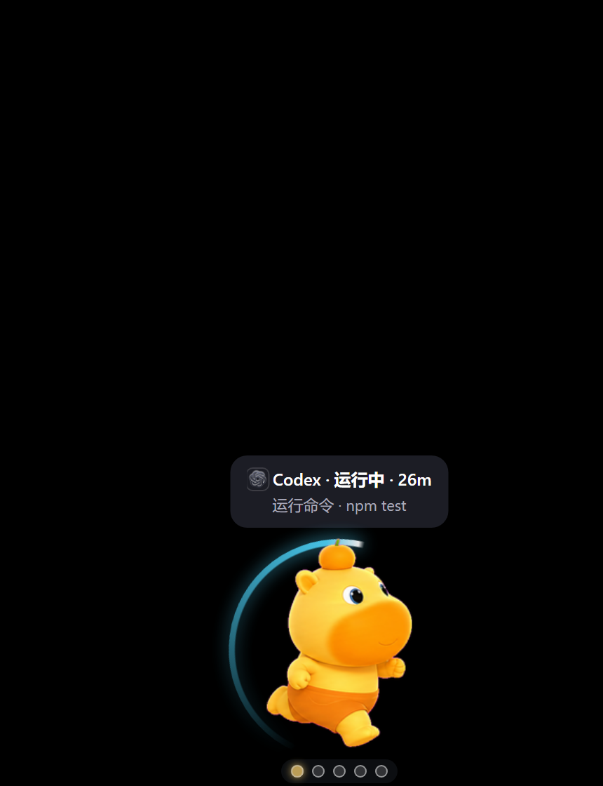
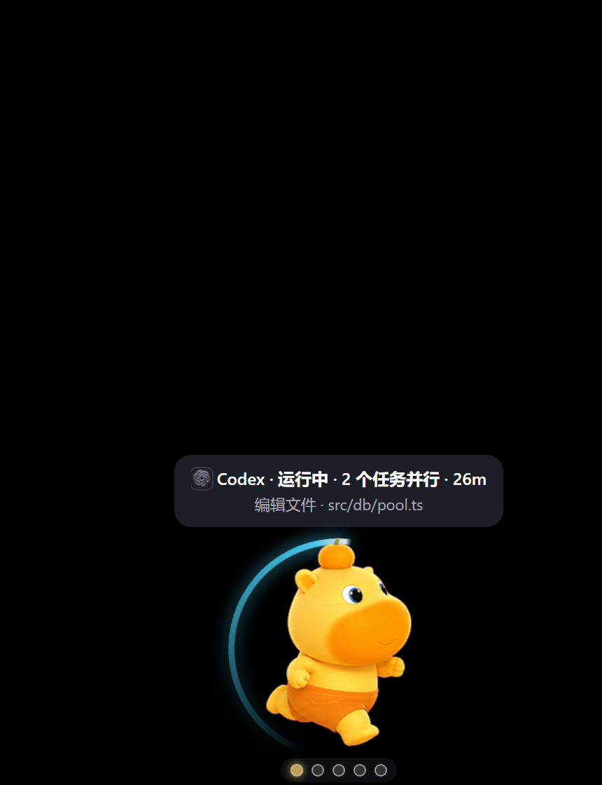
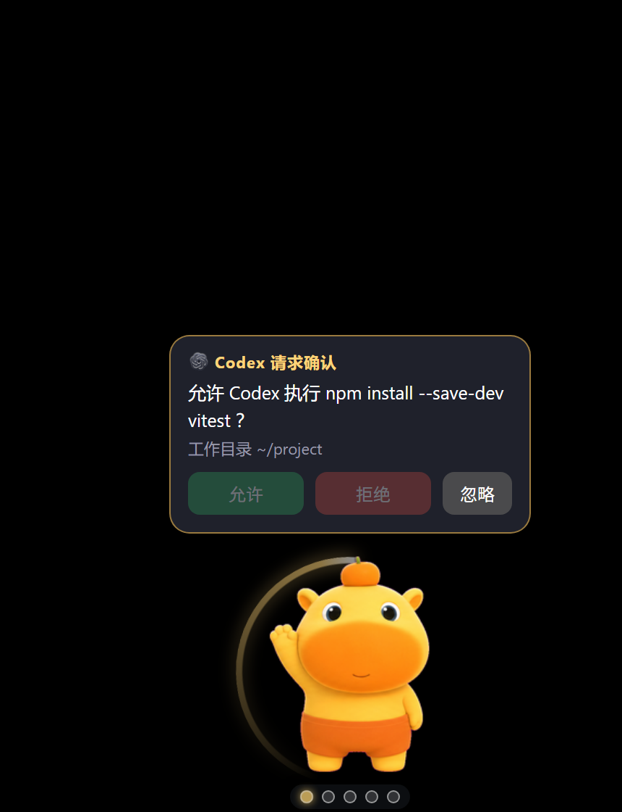
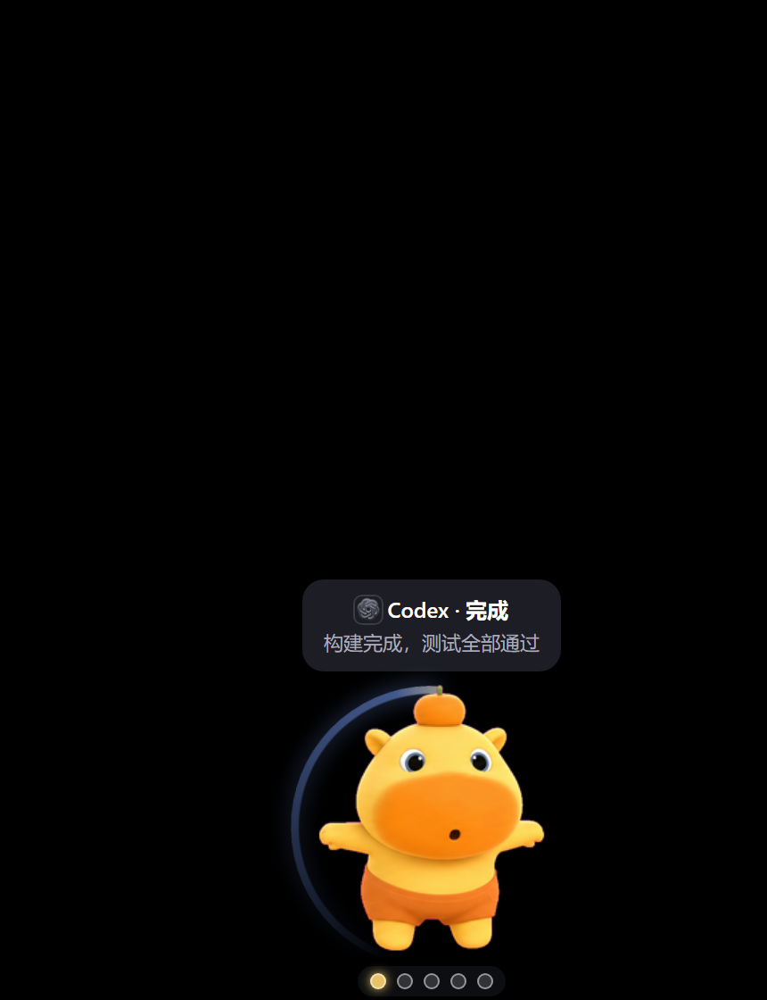
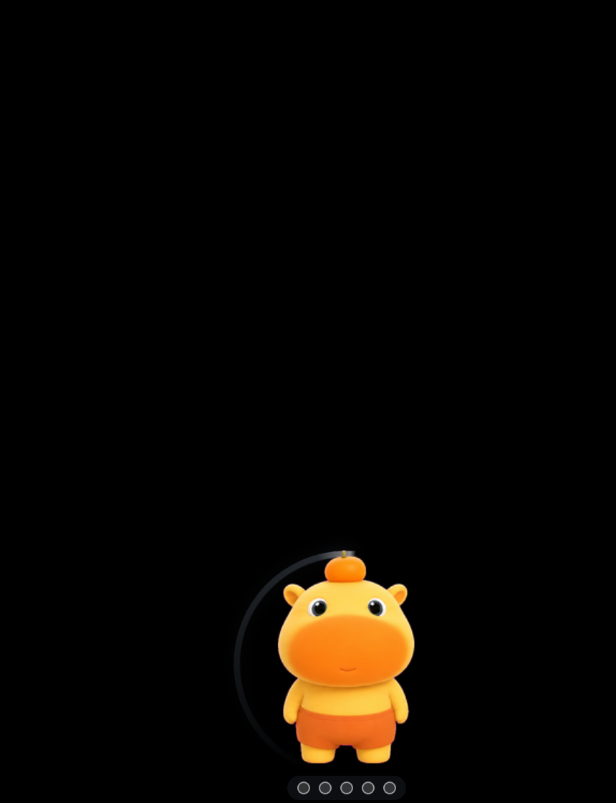
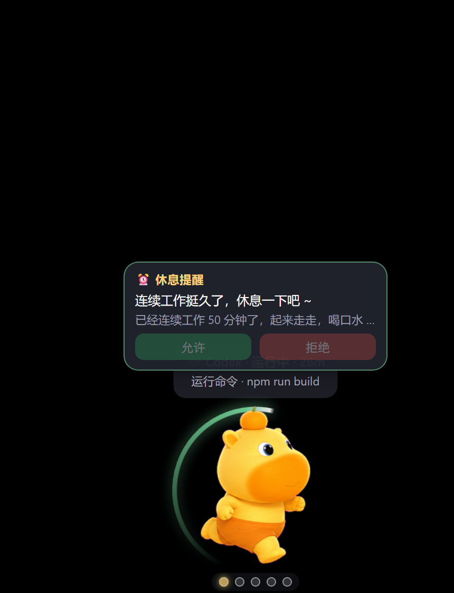
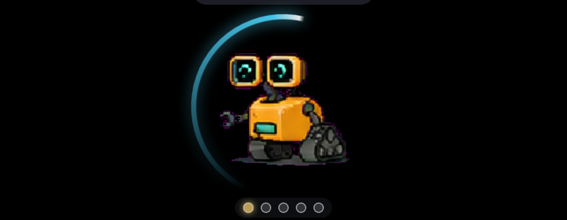
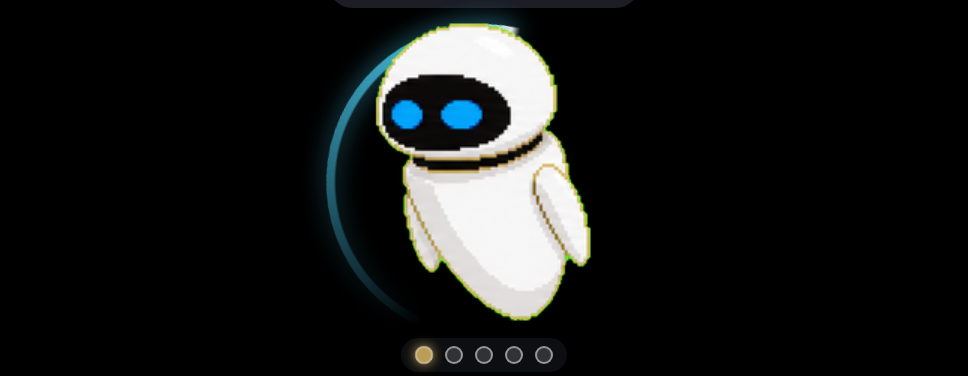
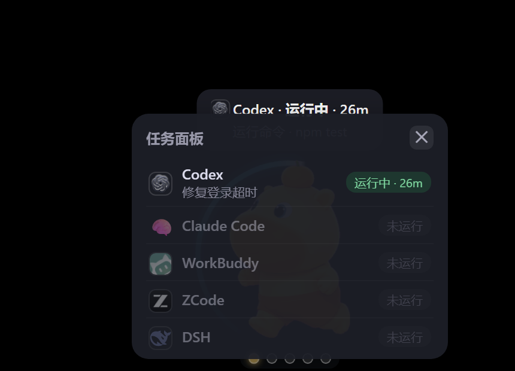
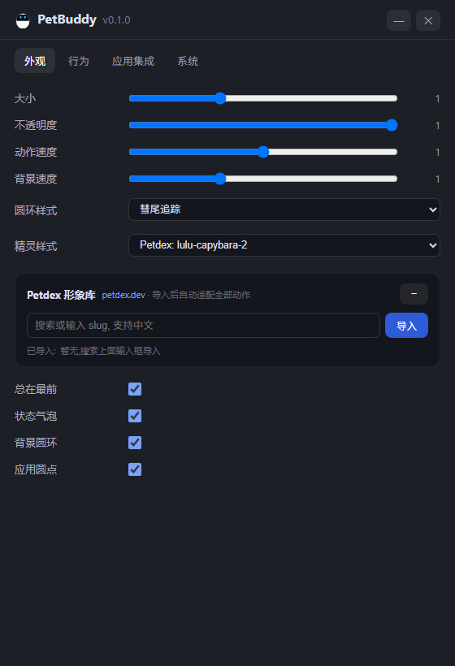

# PetBuddy 🐾

> A unified desktop pet for Windows that watches your AI coding agents — task progress at a glance, approve permission requests right on the pet.

统一的 Windows 桌宠，监控你的 **AI 编码 Agent**：**Codex、Claude Code**、WorkBuddy、ZCode、DSH 开箱即用；**任何**有钩子机制或能发 HTTP 的 Agent，一分钟接入。
实时显示"当前任务进行到哪一步"，应用需要确认时直接在桌宠上点 **允许 / 拒绝**，不用切回应用窗口。

> 💡 上面点名的应用只是**内置预设的例子**，不是支持范围的边界——PetBuddy 的对象是**所有** Agent：
> Claude Code、Cline、Roo Code、Aider、OpenHands……只要有钩子机制（Claude 风格 / 配置文件钩子）或能发 HTTP，就能接入。

<p align="center">
  
  
  
  <br/>
  
  
  
</p>

<p align="center"><i>运行中 · 多任务并行 · 确认直达 · 完成 · 空闲光环 · 休息提醒</i></p>

<p align="center">
  
  
  
</p>

<p align="center"><i>形象随心换：Petdex 形象库按名字导入，内置 EVE / 团子猫 / Tiko 预设</i></p>

<p align="center">
  
  
</p>

<p align="center"><i>任务面板（全部应用一览）· 设置窗口（外观 / 行为 / 应用集成 / 系统）</i></p>

## 功能

- **状态镜像**：每个应用的 运行中 / 待确认 / 完成 / 出错 状态、当前工具调用、步数
- **真实任务计时**：起点读自各应用**自己的会话记录**（Claude 系 transcript、DSH 投影缓存），桌宠重启不归零；应用长时间"思考/深度搜索"不发钩子事件时，照样能从它的记录判定"仍在运行"
- **多任务并行**：同一应用开多个会话/任务时按 sessionId 分别跟踪，气泡显示"· N 个任务并行"，全部结束才算完成；10 分钟无事件的会话自动退役
- **确认直达**：应用弹出权限请求时，桌宠弹出确认卡，点"允许"自动聚焦该应用窗口并发送按键（SendKeys 序列，可在设置中自定义）
- **Petdex 形象库**：从 [petdex.dev](https://petdex.dev/zh) 按名字导入形象，一键切换；Tiko 预置在下拉里，其余形象由唯一的 "Petdex: xxx" 项跟随
- **10 种圆环样式**：经典光弧 / 双环反转 / 缺口旋转 / 彗尾追踪 / 脉冲外扩 / 追光三点 / 虚线段环 / 彩虹流转 / 辉光呼吸 / 双向扫描；颜色随状态（运行中=青 / 待确认=黄 / 完成=蓝 / 出错=红 / 休息提醒=绿 / 空闲=半透明灰蓝并自动放缓），速度可调
- **休息提醒**：连续工作一段时间后弹出绿色提醒卡，光环同步转绿
- **单实例 / 随开随现**：无论开几个应用只有一只桌宠；任一应用启动（或发出事件）自动出现，全部关闭自动隐藏（可配置为退出）
- **设置窗口**：外观（大小 / 透明度 / 精灵 / 圆环 / 动画速度 / 置顶 / 气泡）、行为（自动隐藏 / 提示音 / 超时 / 休息提醒）、应用集成（启停 / 装卸 / ⚙修改名称·颜色·图标·进程名·端口·按键 / 测试按键）、系统（开机自启 / 启动隐藏）；关键处均有悬浮说明
- **任务面板 + 托盘**：点击桌宠展开各应用详细状态；托盘菜单：打开设置 / 日志目录 / 监控列表 / 退出

## 快速开始

环境要求：Windows 10/11，Node.js ≥ 18（仅用于安装依赖，运行时使用项目自带的 Electron）。

```bash
git clone https://github.com/Eapp1e/petbuddy.git
cd petbuddy
npm install
npm start                       # 或双击 start-petbuddy.cmd（隐藏启动: npm run start-hidden）
```

### 接入你的 AI 应用（三步）

```bash
npm run install-integrations    # 为内置应用（Codex / WorkBuddy / ZCode / DSH）自动安装桥接
```

1. 重启对应应用（或新开一个会话）
2. 它一开始干活，桌宠就会出现并显示状态
3. 需要确认时，直接在桌宠上点 **允许 / 拒绝**

## 接入原理

| 应用 | 机制 | 写入位置 |
|---|---|---|
| Codex | 原生 hooks（kebab 事件名）+ `notify` 包装（回合完成，原 notify 链式保留） | `~/.codex/hooks.json`、`~/.codex/config.toml` |
| Claude Code | Claude 风格 `hooks` 键（添加应用 → 自动接入） | `~/.claude/settings.json` |
| WorkBuddy | Claude 风格 `hooks` 键 | `~/.workbuddy/settings.json` |
| ZCode | config-file hooks（7 个事件 → `bridge/pet-bridge.mjs`） | `~/.zcode/cli/config.json` |
| DSH | 挂载 `@deepseek-ai/dsh-hooks-claude-code` 指向 `~/.petbuddy/dsh-hooks.json` | `<DSH_HOME>/profiles/web/cordis.patch.yml`（patchReload: live，无需重启） |

> **上表只是内置预设，不是支持范围的边界。** Claude 系 Agent（Claude Code、Cline、Roo Code…）都能用
> claude-file 样式接入；有 HTTP 能力的用镜像模式；新钩子格式加一个 handler 即可（见下文）。

- 所有钩子只**镜像状态**，永不阻塞/失败（桥接 2 秒超时、始终 exit 0）
- 桥接发现桌宠未运行时会用 `--spawn` 拉起它（因此任一应用一动，桌宠就会出现）
- 修改前自动备份（`*.petbuddy-bak`），卸载接入只删除 petbuddy 条目
- 审批回传：ZCode/Codex/WorkBuddy 通过**键盘注入**（聚焦窗口 + SendKeys）；DSH 是网页 UI，桌宠仅镜像提示，审批仍在网页完成
- Token/余额消耗暂未实现（可后加）

## 本地 API（127.0.0.1，端口见 `~/.petbuddy/port`，默认 47650）

```
GET  /api/ping          存活检查
GET  /api/status        完整状态快照
POST /api/event         {app, event, title?, detail?, question?}
POST /api/announce      {app} 心跳
POST /api/confirm       {id, decision: approve|deny|dismiss}
```

`event` 取值：`announce / session-start / prompt / pre-tool / post-tool / post-tool-failure / permission / stop / message / turn-complete / compact`

手动测试：

```bash
curl -X POST http://127.0.0.1:47650/api/event -d "{\"app\":\"zcode\",\"event\":\"pre-tool\",\"detail\":\"Bash: ls\"}"
```

未知 `app` 会**自动注册**并立即显示（镜像模式，无按键回传）——任何能发 HTTP 的程序都能接入。

## 添加自定义应用

在 设置 → 应用集成 → ➕ 添加应用 填写（只填应用 ID 和显示名称即可），或直接编辑
`~/.petbuddy/apps.config.json`：

```jsonc
{
  "apps": [
    {
      "id": "myapp", "name": "MyApp", "color": "#ff8844", "emoji": "🧩",
      "icon": "D:/icons/myapp.png",
      "processNames": ["MyApp.exe"],
      "ports": [],
      "keys": { "approve": "{ENTER}", "deny": "{ESC}" },
      "integration": [
        { "style": "zcode-config" },
        { "style": "claude-file", "path": "~/.myapp/agent.json", "eventCase": "kebab", "standalone": true },
        { "style": "codex-notify" },
        { "style": "dsh-patch" }
      ]
    }
  ]
}
```

`eventCase`: `pascal`（SessionStart）/ `kebab`（session-start）。改完点 设置 → 应用集成 → "🔄 重新扫描应用"。
若新应用的钩子格式不属于以上任何一种，在 `integrations/install.mjs` 的
`STYLE_INSTALL / STYLE_UNINSTALL / STYLE_STATUS` 三个表里各加一个 handler 即可，主进程与 UI 不用动。

## 项目结构

```
main.js            Electron 主进程（窗口 / 托盘 / 看门狗 / IPC）
pet.html           桌宠本体（精灵渲染 / 状态气泡 / 确认卡 / 圆环样式）
settings.html      设置窗口（外观 / 行为 / 应用集成 / 系统）
lib/               状态机、应用注册表、任务计时、按键注入、HTTP 服务
bridge/            钩子桥接脚本（各应用钩子负载 → 统一事件）
integrations/      接入安装器（zcode-config / claude-file / codex-notify / dsh-patch）
```

## 数据与日志

- 配置：`~/.petbuddy/config.json`（设置窗口里改）
- 应用注册表：`~/.petbuddy/apps.config.json`
- 日志：`~/.petbuddy/petbuddy.log`

## 注意

- 确认按键默认 `允许={ENTER}`、`拒绝={ESC}`；如应用实际弹窗不同（如需要按 `1`），在 设置 → 应用集成 → ⚙ 修改 里改按键序列并点"测试"
- **Codex**：notify 包装开箱即用（回合完成通知）。hooks.json 里的条目还需**一次性信任**：在 codex 交互界面输入 `/hooks`，把 PetBuddy 的钩子标记为 trusted（codex 的安全设计，未经审核的钩子不执行）
- **DSH** 的 hooks 配置只在服务启动时读取一次——修改桥接配置后需重启 DSH 服务
- 钩子命令统一走 `~/.petbuddy/pet-bridge.cmd` 垫片（兼容 cmd / PS1 / 直接 spawn 三种执行环境）
- 开机自启写注册表 `HKCU\...\Run`，指向当前应用目录

## License

[MIT](LICENSE) © 2026 EAPPLE
